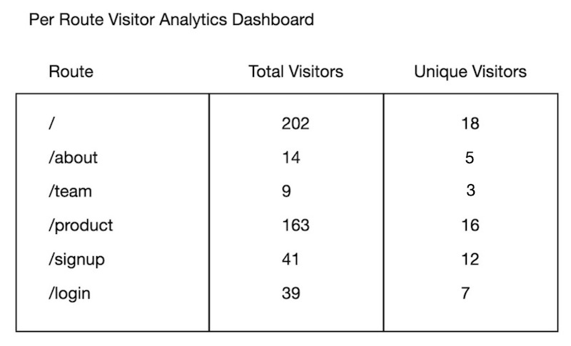

# Assignment 5: A Sessioned Landing Page
#### Due Friday, June 05, 2020 @ 11:59pm

Basic website analytics

## Overview

During lecture this week, we discussed the concept of sessions (see this video: https://www.youtube.com/watch?v=klumxiZYKJA). In this assignment, we will add a basic, session-based user tracking feature to your website. 

This assignment is implemented in three parts. In part 1, you'll add a basic session handler to your site to track users (whether they are logged in or not).  In part 2, you'll add "route tracking" for each user (via session-id) in a table. In part 3, you'll show user activity (analytics) on a one-page dashboard.


## General Requirements

### Part 1 -- Setting up Sessions

Following the video tutorial linked above, add a session-based login management system to your landing page. You may either reuse the styles and pages from Assignment 4 or start from scratch. However, **BEFORE** you start working on the assignment, clone the code associated with the tutorial (https://github.com/ramujin/ece140_pyramid_security) and verify that you are able to get it working. If you skip this step and then come to us for help, we will just direct you right back here!

At a bare minimum, create a ```/admin``` route that is only accessible by logged in users. This will be your analytics page (Part 3). You may create additional secured pages, but this one is required. Your TAs will test to see if they are able to access it without being logged in, so make sure it is tested well.


### Part 2 -- Route Tracking

As your visitors navigate your existing site, your server will receive requests at specific routes (URLS). For each route your visitor sees, add an entry into `visits` table in your database. Your schema for the `visits` table is up to you, but it may look something like this:

```
1. id (autoincrementing primary key -- so each row is unique)
1. session_id  (of the user visiting the route)
2. route_name  (could also be the URL if you prefer)
3. timestamp (when the user visited the route)
```

You are required to track a minimum of 5 routes. Here's a list of routes we suggest you consider for tracking purposes:

1. /   -- your home page
2. /about
3. /product
4. /team
5. /register
6. /login
7. /privacy


### Part 3 -- A Visitor Analytics Dashboard

After users have visited various pages of your site, you may want to see which pages get the most traffic. In this part, you'll build an analytics page to shows user activity on a per page basis. Although your routes may be different, here's an example of what such a dashboard might look like:



## Submission

Submit all of your source code to this repository.
In addition, include a REPORT.md file and provide the link to your public Digital Ocean IP address inside that document.

## Due Date

**Friday, June 05, 2020 @ 11:59pm**
